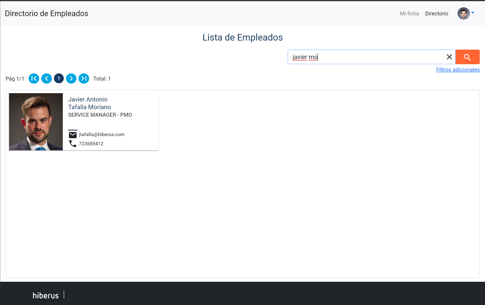
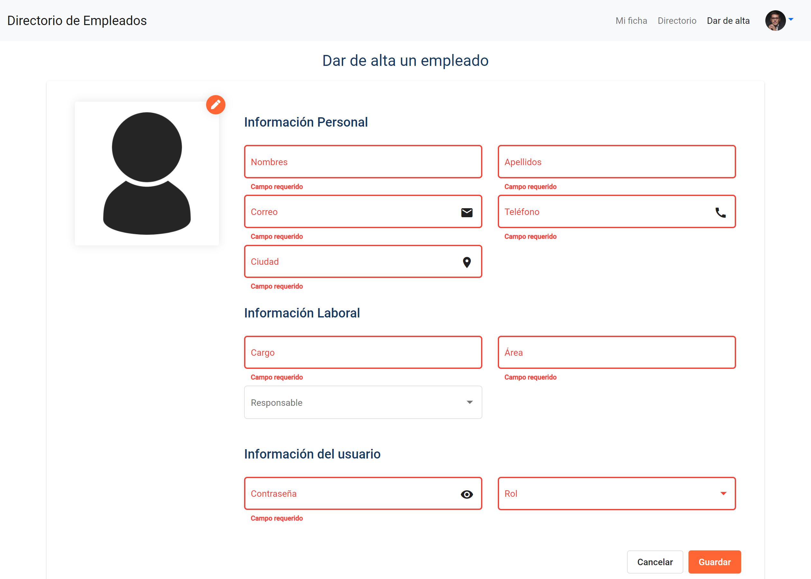

# Casos de prueba

## Datos de prueba

* Con la información cargada de prueba todos los usuarios tienen como password: Password01
* Solo existe registrado un usuario administrador y es: admin@hiberus.com
* Con el fin de alcanzar con el tiempo de desarrollo las fotografías de los empleados, al guardar estas se suben al directorio resources del proyecto, esta funcionalidad se la puede mejorar con mas tiempo, dado la posibilidad de integrar un servidor de archivos.
* Se a cargado 35 empleados de ejemplo.

## Ingresar al sistema con el rol de empleado

Para la prueba vamos a tomar un usuario con rol de empleado por ejemplo: arentero@hiberus.com

***Casos de uso***

1. **Buscar empleados por nombres**

   Buscamos por nombre y parte del apellido. Ingresamos : javier mo

   

   Buscar por email: Ingresamos: 

   

   

2. **Buscar con filtros adicionales**

   Activamos los filtros adicionales

   Buscar por ciudad: Escojamos: SEVILLA

   

   

   

   Escojamos: Ciudad SEVILLA y Cargo TECHNICAL LEADER

   

   

   

   Escojamos: Ciudad SEVILLA, Cargo TECHNICAL LEADER y Área CONTROL

   

   Limpiemos os filtros e ingresemos:

   Busquemos todas las personas que tienen como tecnología: JAVA y Angular

   

   

   Del resultado busquemos quienes pertenecen al proyecto: PORTAL MADRID.ES y GESTIÓN TRIBUTARIA MADRID

   

   

   De la lista anterior nos interesa que tengan la certificación: FRONTEND ANGULAR

   

   

Necesitamos que su apellido sea: romero

1. **Ver mi su ficha**

   Demos clic en el nombre del empleado que aparece en la ficha

   

   Esto nos permite navegar a la ficha de ese empleado

   

   Como el usuario tiene un rol de Empleado y no es su ficha, este solo puede verla y no editarla.

   

2. **Ver ficha de otro empleado**

   Nos dirigimos al menú de la aplicación y damos click en Mi fiha

   

Al ser la ficha del empleado en sesión tenemos la opción de editar su información. Para ello solo debemos dar click en el lápiz para que cada sección de la ficha pase a modo de edición.

1. **Actualizar su ficha**

En esta sección el usuario puede editar toda su información menos su email ya que es su cuenta de usuario y su rol, ya que es un usuario con rol de Empleado.

Podemos editar la foto: Al escoger una foto del sistema de archivos, podemos acercarla / alejarla y seleccionar la zona que mas nos interese.

Al dar click en guardar podemos cambiar la información principal del empleado.

Editar una categoría:

Si damos click en el lápiz habilita el modo de edición de la sección.

Podemos escoger una de las opciones existentes:

O ingresar una nueva y dar enter para confirmar su adición.

Podemos quitar un item al dar click en la (X) de este. Y al dar en guardar se registrara esta información y pasaremos a la vista de visualización:

## Ingresar al sistema con el rol de administrador

En los datos de prueba solo existe registrado un usuario administrador, podemos ingresar con: admin@hiberus.com

**Casos de uso**

1. **Dar de alta un empleado**

   En la barra de menú de la aplicación damos clic en: Dar de alta

   

   

   Ingresamos a la siguiente pantalla, la cual contiene información requerida para el registro del empleado

   

   

   Ingresamos la información requerida y damos clic en guradar.

   

   

   Al guardar nos redireccionamos a la ficha del empleado que se registro, permitiéndonos registra el resto de su información.

   